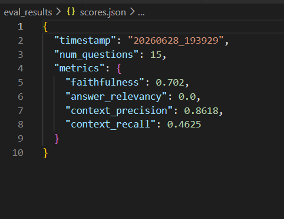
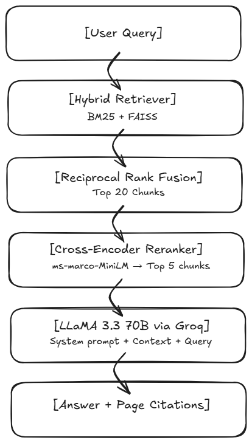
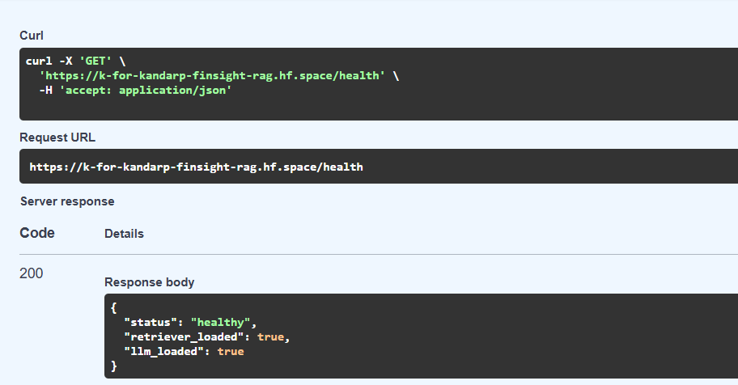
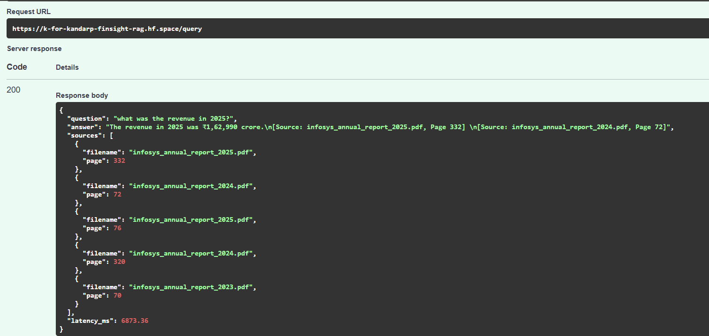

<h1 align="center">📊 FinSight RAG</h1>
<p align="center">
  <b>Financial Document Intelligence System</b><br>
  Production-grade RAG pipeline for querying Infosys Annual Reports with cited, grounded answers
</p>

<p align="center">
  
  
  
  
  
</p>

---

## 🚀 Live Demo

| Endpoint | Link |
|---|---|
| Interactive API Docs | [/docs](https://k-for-kandarp-finsight-rag.hf.space/docs) |
| Health Check | [/health](https://k-for-kandarp-finsight-rag.hf.space/health) |

> ⚠️ First request may take 2-3 minutes on free tier cold start. Subsequent requests respond in ~7-8s.

---

## 📊 Evaluation Results (RAGAS)

Evaluated on a **15-question hand-crafted financial domain dataset** built directly from source documents.

| Metric | Score | What It Measures |
|---|---|---|
| **Context Precision** | **0.8618** | % of retrieved chunks that were genuinely useful |
| **Faithfulness** | **0.7020** | % of answer claims grounded in retrieved context |
| **Context Recall** | **0.4625** | % of relevant information successfully retrieved |



> Answer Relevancy showed 0.0 due to a known limitation with smaller judge models in RAGAS — the 8B model used for evaluation couldn't reliably follow the structured output format required for reverse question generation. Manually verified answers are on-topic and correctly cited.

---

## 🏗️ Architecture



**Why hybrid retrieval?** Pure semantic search (FAISS) struggles with exact financial terms — a query for "FY2024 revenue" needs exact keyword matching as much as semantic understanding. BM25 handles keyword precision, FAISS handles conceptual similarity. Combined via Reciprocal Rank Fusion they outperform either alone.

**Why cross-encoder reranking?** The retriever uses bi-encoders — query and chunks embedded separately, then compared. Fast but approximate. The cross-encoder reads query and chunk together, like a human would, giving much higher relevance precision. Two-stage retrieval: fast candidate generation → accurate reranking.

**Why citation enforcement?** The system prompt hard-codes a rule: answer only from retrieved context, always cite source and page number, say "I don't know" if context is insufficient. This eliminates hallucination by design rather than relying on model behaviour.

---

## 🔧 Tech Stack

| Layer | Technology |
|---|---|
| **PDF Ingestion** | PyPDFLoader, RecursiveCharacterTextSplitter |
| **Embeddings** | all-MiniLM-L6-v2 (Sentence Transformers) |
| **Vector Store** | FAISS |
| **Keyword Search** | BM25 (rank_bm25) |
| **Retrieval Fusion** | LangChain EnsembleRetriever |
| **Reranking** | ms-marco-MiniLM-L-6-v2 (Cross-Encoder) |
| **LLM** | LLaMA 3.3 70B via Groq API |
| **Evaluation** | RAGAS |
| **Observability** | LangSmith |
| **API** | FastAPI + Uvicorn |
| **Containerization** | Docker |
| **Deployment** | HuggingFace Spaces |

---

## 📡 API Reference

### `GET /health`
Returns service status and index load confirmation.

```json
{
  "status": "healthy",
  "retriever_loaded": true,
  "llm_loaded": true
}
```



### `POST /query`
Query the financial documents with a natural language question.

**Request:**
```json
{
  "question": "What was Infosys revenue in FY2025?",
  "top_n": 5
}
```

**Response:**
```json
{
  "question": "what was the revenue in 2025?",
  "answer": "The revenue in 2025 was ₹1,62,990 crore.\n[Source: infosys_annual_report_2025.pdf, Page 332]",
  "sources": [
    {"filename": "infosys_annual_report_2025.pdf", "page": 332},
    {"filename": "infosys_annual_report_2024.pdf", "page": 72}
  ],
  "latency_ms": 6873.36
}
```



---


## ⚙️ Local Setup

```bash
# Clone
git clone https://github.com/kforkandarp/finsight-rag.git
cd finsight-rag

# Virtual environment
python -m venv venv
venv\Scripts\activate        # Windows
source venv/bin/activate     # Mac/Linux

# Install dependencies
pip install -r requirements.txt

# Environment variables — create .env file
GROQ_API_KEY=your_groq_key
LANGCHAIN_API_KEY=your_langsmith_key
LANGCHAIN_TRACING_V2=true
LANGCHAIN_PROJECT=finsight-rag

# Run
uvicorn api.main:app --host 0.0.0.0 --port 8000
```

Open `http://localhost:8000/docs` to test.

---

## 🐳 Docker

```bash
# Build
docker build -t finsight-rag .

# Run
docker run -p 8000:8000 \
  -v $(pwd)/data/raw_pdfs:/app/data/raw_pdfs \
  --env-file .env \
  finsight-rag
```

---

## 🔮 Future Improvements

- **FAISS index persistence** — save index to disk, eliminate 60s rebuild on every startup
- **S3 storage for PDFs** — replace baked-in PDFs with cloud storage for scalable document management
- **Streaming responses** — reduce perceived latency with token streaming
- **Larger RAGAS judge model** — use GPT-4o or 70B model for accurate answer relevancy scores
- **Multi-document support** — extend beyond Infosys to any financial filing

---

## 📄 License

MIT